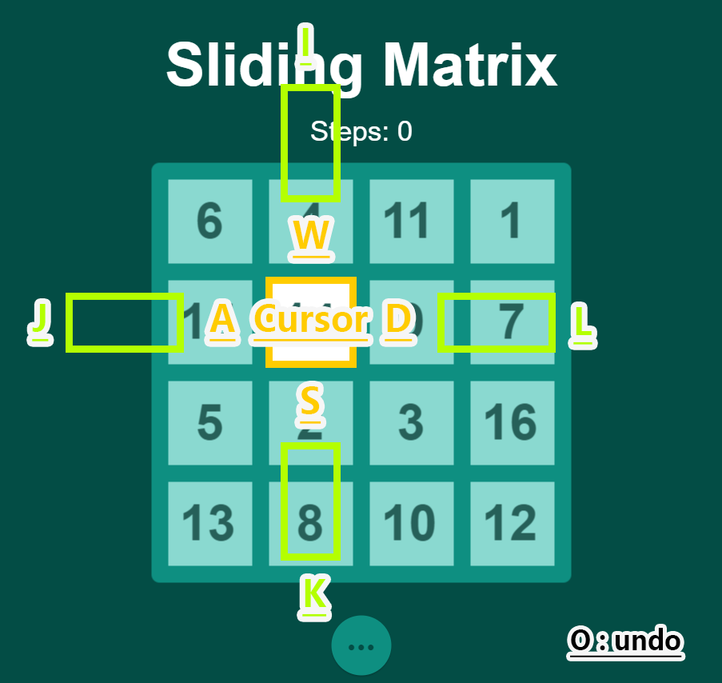
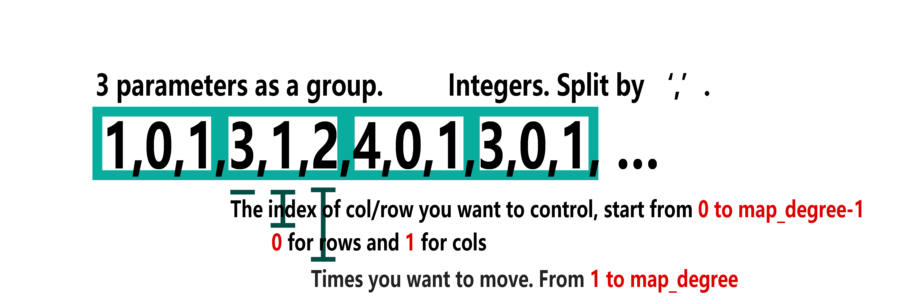

# Sliding Matrix

**Authors: [eEhyQx](https://github.com/eEhyQx), [greatoyster](https://github.com/greatoyster) .**

- [x] Basic rules
- [x] GUI
- [x] Undo the previous step
- [x] Step documents
- [x] Create map by degree
- [x] Set map by sequence
- [x] Import steps according to sequence 
- [x] Download my solution
- [x] Help
- [ ] Create a map by seed
- [x] PlayGround Mode
- [x] Get Battle-map
- [x] Upload solution
- [ ] Score board
- [x] Battle Mode
- [ ] Tips
- [ ] Mobile Device Version
- [ ] Tricks

Sliding Matrix is a game designed by Qixuan Zhang, Zihan Jia, and Yuming Xiang, which shared similar rules with Rubik's Cube. The player who solves the Sliding Matrix through the fewest steps will win the game.

[Click to play!](https://eehyqx.github.io/SlidingMatrix/SlidingMatrix.html)

##  How to play?

A Sliding Matrix is a square with `n*n` blocks filled with misplaced integers from `1` to `n*n`. Select a `row`(or `col`) by move the Cursor through `W(up)-A(left)-S(down)-D(right)`.  Then click `I(up)-J(left)-K(down)-L(right)` to 'swipe' the `row`(or `col`). Click `O` to undo the previous step. Click `U` to switch to `Battle Mode`.

Solve the sliding Matrix by transforming it to ordered integer `1~n*n`.

## Basic tricks

## PlayGround Mode

PlayGround Mode is a mode for training and testing. In this mode you can,
- [x] Create a random or ordered map by degree
- [x] Set map by sequence
- [x] Import steps according to sequence
- [x] Download my solution
- [ ] Create a map by seed

**Create a map by degree**

Select Map-degree from `2~15`, then click `SUBMIT` to generate an ordered map, or `RANDOMIZE` for a random one.

**Set map by sequence**

Enter a sequence like `1,2,3,4,5,6,7,8,9` to generate a map as you wish. The sequence should satisfying following conditions,

1. Each number should be split by `,`.
2. It should be a legal map, which means the sequence should have a length of `n*n` and filled with numbers from `1 to n*n`.
3. It needs to be able to be solved. We will help you confirm this based on the conclusions of paper in reference.

**Import steps**

Enter a sequence of steps to transform the map. The sequence should be formed like the following case.

 

**Download my solution**

Save the steps you entered so far as a `.txt` file, and download it. The steps are stored with the same format of Inputs of **Import steps**.

## Battle Mode

Battle Mode will show the map that posted on our GitHub repo, which will automatically be generated randomly every week by the backend.  Players should solve it through the minimal steps and upload it. After checking it will be shown on the global Score board. In this mode you can,

- [x] Import steps according to sequence
- [ ] Check global Score board
- [ ] Upload my solution
- [x] Download my solution

When clicking `U` switch to the `Battle Mode`, the color of the scenery will be reversed. `Battle Mode` and `PlayGround Mode` are parallel, they don't share the map or step_documents, you can switch between them by clicking `U` any time you want.

**Import steps**

Enter a sequence of steps to transform the map. The sequence should be formed like the following case.

 

**Download my solution**

Save the steps you entered so far as a `.txt` file, and download it. The steps are stored with the same format of Inputs of **Import steps**.

## Reference

[Research into 2D Magic Cube  and Cayley Graph Diameter](https://github.com/eEhyQx/WeCreate/blob/master/0x02.%5Ben%5DResearch%20into%202D%20Magic%20Cube.pdf)

[对平面魔方群及其Cayley图直径的研究](https://github.com/eEhyQx/WeCreate/blob/master/0x02.%5Bcn%5D%E5%AF%B9%E5%B9%B3%E9%9D%A2%E9%AD%94%E6%96%B9%E7%BE%A4%E5%8F%8A%E5%85%B6Cayley%E5%9B%BE%E7%9B%B4%E5%BE%84%E7%9A%84%E7%A0%94%E7%A9%B6.pdf)